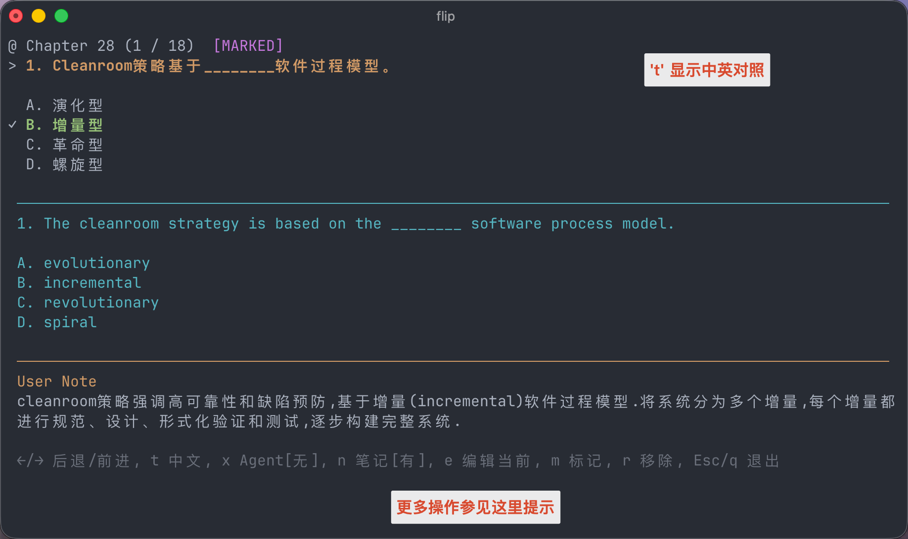
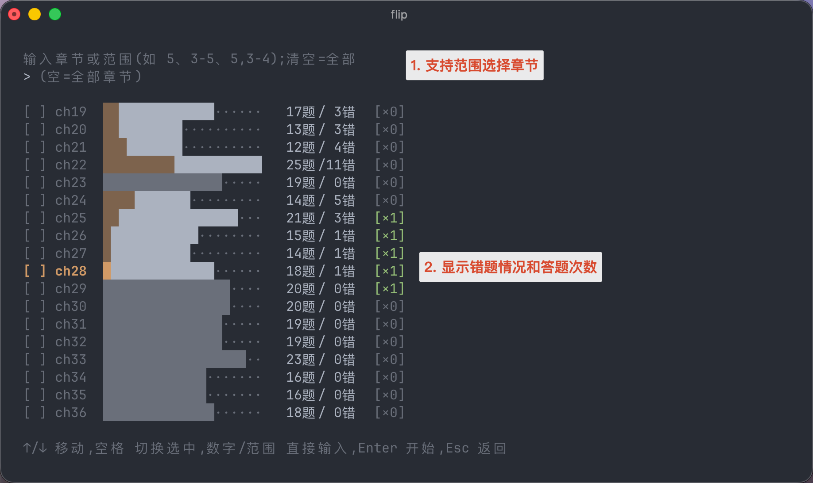

# flip

[中文](README.md) · [English](README_en.md)

A terminal quiz tool powered by skill-driven agent: turn any subject into tailored exercise with one simple prompt.

## Features

- **Deck-agnostic quiz engine** — one schema serves any subject; question shape and persona come from the deck manifest, the engine carries no subject assumptions.
- **Native terminal TUI** — deck picker with live search and **Library / Bootstrap** tabs (←/→ to switch), multi-select chapters, adaptive width and resize redraw.
- **Multiple drill modes** — Train (tiku, scored), Review (wrong index, scored), Ans (browse with answers shown, no scoring), Continue (resume a paused drill).
- **Wrong-index & stats** — auto-maintained wrong-question index, per-chapter stats page, drill-count badges per question.
- **Marks & notes** — flag a question, attach a note; filter by mark/note/ai.
- **AI explanation of mistakes** — generate explanations via a configurable backend (codex / Zhipu GLM / ollama …); the persona comes from the deck.
- **Bilingual translation** — global toggle: when `source_lang ≠ target_lang`, the `t` key shows, `zh` fields are written, and AI prompts carry translations.
- **Import / export / merge** — import from JSON / CSV / deck directory, one-command export for backups, `merge` with -append/-upsert/-overwrite preserves learner state.
- **On-demand bundled decks** — bundled decks ship in the package and can be explicitly installed, updated, reinstalled, and inspected through Bootstrap.
- **Companion agent skills** — `flip-deck-init` builds a deck from raw material, `flip-deck-maintain` safely updates an existing one.

## Install

**pipx (recommended, all platforms):**

```bash
# macOS / Linux: install pipx first (skip if you already have it)
brew install pipx                 # macOS/Linux
# Windows: install pipx via PowerShell (skip if you already have it)
python -m pip install --user pipx # requires Python 3.9+
python -m pipx ensurepath         # put pipx-injected commands on PATH, then reopen the terminal

pipx install git+https://github.com/ffy6511/flip.git
```

**Homebrew (macOS / Linux only):**

```bash
brew tap ffy6511/tap
brew install flip
```

**Testing an unreleased branch:**

```bash
# Install a specific branch directly (e.g. to validate the Windows-compat branch on Windows):
pipx install git+https://github.com/ffy6511/flip.git@feat/windows-compat
pipx reinstall flip               # update after new commits land on the branch
```

**Upgrade an existing install:**

```bash
brew update && brew upgrade flip  # macOS/Linux, Homebrew install
pipx upgrade flip                 # any platform, pipx install
```

**(Optional) Companion skills for the CLI**

```bash
npx skills add ffy6511/flip/skills   # install the companion skills; see below for what each does
```

**For development:**

```bash
git clone https://github.com/ffy6511/flip.git
cd flip
python3 -m venv .venv && .venv/bin/pip install -e ".[dev]"
.venv/bin/flip --help
```


## Supported platforms

flip is pure Python with no compiled dependencies and runs on:

| Platform | Install | Data directory |
|----------|---------|----------------|
| macOS / Linux | `brew install` or `pipx install` | `~/.local/share/flip/` |
| Windows | `pipx install` (install [pipx](https://pypa.github.io/pipx/) first) | `%APPDATA%\flip\` |

> The terminal must support ANSI escape sequences. Windows 10+ supports them out of the box (flip enables Virtual Terminal processing on first draw); on older builds, upgrade or run inside Windows Terminal.

The `$FLIP_HOME` environment variable overrides the default data directory on every platform.


## Getting started

Run `flip` with no arguments. You land in a deck picker with two tabs at the top — switch with **←/→**:

- **Library** — your installed decks. Pick one with ↑/↓ + Enter (typing filters by slug/name). When empty it shows a hint pointing at the Bootstrap tab (and the `flip import` command) instead of aborting, so you can install your first deck without leaving the picker.
- **Bootstrap** — bundled deck management. Select with **space**, press **Enter** to confirm install/update/reinstall, press `c` to view the changelog, and press `u` to toggle whether upstream notes may overwrite local notes.

Bundled decks ship inside the package (currently the Software Engineering template, 561 questions, English→Chinese). Install, update, and reinstall actions are explicit; `flip deck remove <slug>` deletes a deck entirely, after which it can be installed again from Bootstrap.

<table>
  <tr>
    <td></td>
    <td></td>
  </tr>
</table>

## Optional: companion agent skills

The `skills/` folder in this repo holds skills that teach an AI agent (Claude
Code, Cursor, ZCode, …) how to work with flip. They are **not** shipped with
the pip/brew package — install them with the one-liner in the Install section
above, then just ask your agent to act. The current set:

| Skill | What it does |
|-------|--------------|
| [`flip-deck-init`](skills/flip-deck-init/) | Turn any quiz material (PDF / HTML / Word / notes) — or an existing question-bank JSON — into a schema-compliant deck and register it via `flip import`. Covers both bootstrapping a new deck from raw material and importing an already-structured JSON. |
| [`flip-deck-maintain`](skills/flip-deck-maintain/) | Safely update an existing deck by choosing between `flip deck merge` and direct `tiku.json` edits while preserving ids, marks, wrong-history, notes, translations, and Agent Said fields. |

## Concepts

- **deck** — a subject (SE, compilers, ...). Lives in `~/.local/share/flip/decks/<slug>/`.
- **topic** — the *stem text* of a single question (kept as the `topic` field for backward compat with existing data).
- **chapter** — a grouping key inside a deck's `tiku.json`.

See `docs/schema.md` and `docs/deck-manifest.md` for the data contracts.

## Usage

```bash
flip                              # interactive: pick a deck, then pick a mode
flip --version                    # print the installed version
flip list                         # list registered decks
flip deck train se -c 5-10        # train SE on chapters 5–10 (tiku, scored)
flip deck review se               # drill SE's wrong index (scored)
flip deck continue se             # resume the latest paused scored drill
flip deck train se --ans          # browse SE showing answers, no scoring
flip deck stats se                # per-chapter distribution
flip deck clear-count se --mode all  # clear stored train/review counts only
flip deck mark se                 # list marked questions
flip deck wrong se                # list wrong-index questions
flip deck merge se ./new.json --dry-run  # preview an incremental deck update
flip deck update se              # update from the bundled deck, preserving learner state
flip deck prune se               # remove bundled questions deleted upstream but still local
flip deck versions se            # list/switch bundled deck backup versions
flip deck assign-ids se --dry-run  # add q-<12hex> stable ids to questions missing ids
flip deck repair se --dry-run     # validate tiku and rebuild marked index
flip deck translate se            # fill missing zh fields
flip import se ./tiku.json        # register a compliant JSON as a new deck
flip export se -o ./se-deck       # bundle a deck for backup or transfer
flip config                       # show config and explain-backend status
```

> Subcommand order is `flip deck <verb> <slug>` (verb before slug).
> Chapter selectors accept single chapters, ranges, first-N shorthand, and
> comma unions: `5`, `5-10`, `-3`, `5,3-4`; press `a` to auto-select the chapters with the lowest count for the current mode.
> Running `flip` with no args starts in the deck picker (see [Getting started](#getting-started)): pick a deck on the **Library** tab (↑/↓ + Enter, live search) or install a bundled one on the **Bootstrap** tab (←/→ to switch). After choosing a deck you pick a mode — **Train** (tiku), **Review** (wrong index), **Continue** (paused scored drill), or **List** (stats) — plus the 1-5 filters/display toggles, a **clear-count** action, and an **Ans mode** toggle that shows answers without scoring.
> While browsing a question, press `e` to edit the standard answer. AI follow-up prompts and user-note inputs support `Ctrl+U` to clear the current buffer.

## Layout

```
src/flip/      engine, TUI, store, config, deck manifest, explain
docs/          schema.md (tiku.json), deck-manifest.md, import.md
decks/example/ minimal demo deck (also a test fixture)
skills/        flip-deck-init — agent skill to bootstrap a deck from source material
tests/         pytest suite, including focused TUI-loop regressions
```

## Acknowledgements

- This project was inspired by [Zhang-Each/SE-FSE-exercise](https://github.com/Zhang-Each/SE-FSE-exercise.git).
- Some of the original `tiku` question data used to build decks for flip was sourced from that project's JSON files.
